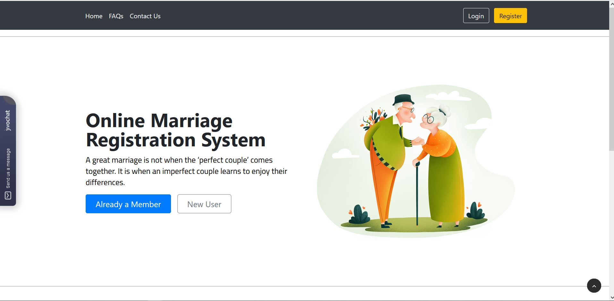
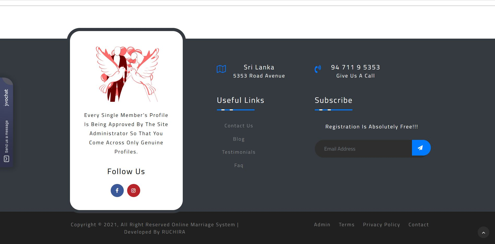

How to run the Online Marriage Registration System using PHP and MySQL

1.Download the zip file or clone this repository on your computer

2.Extract the file and copy letsmarriage folder

3.Paste inside root directory(for xampp xampp/htdocs, for wamp wamp/www, for lamp var/www/html)

4.Open PHPMyAdmin (http://localhost/phpmyadmin)

5.Create a database with name " omrsdb "

6.Import omrsdb.sql file(given inside the zip package in SQL file folder)

7.Run the script http://localhost/letsmarriage

User Credential
------------------
Username: 077112244
Password: log1234

Admin Credential
------------------
Username: admin
Password: log123

Demo Video :- https://www.youtube.com/watch?v=KFJ_46qMHE8
 
Demo Site:- https://letsmarriage.wemixt.com/ 
(Visit My website :-https://ruchiras.com/ )

